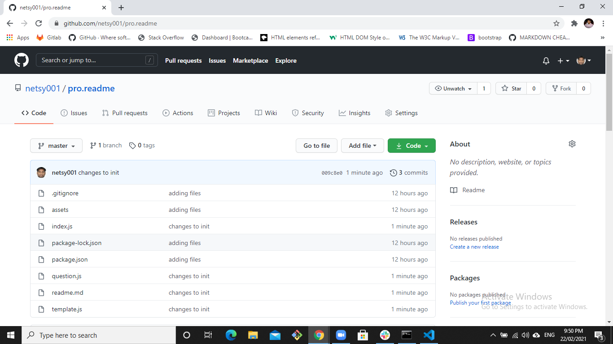

hgfhdjtyjtyj

## Table of Content
* [Project Links](#Project-Links)
* [Screenshots-Demo](#Screenshots)
* [Project Objective ](#Project-Objective)
* [User Story ](#User-Story)
* [Installation](#Installation)
* [Usage](#Usage)
* [Tests](#Tests)
* [Author Contact ](#Author-Contact)
* [License](#License)

## Project Links
https://github.com/netsy001/pro.readme

## Screenshots - Demo
<kbd></kbd>

## Project Objective
fgghfhfgfg
  
## User Story
gfgdggb ggrhtrrt

## Installation
gthtrhrjhstrjrs

## Usage
hhjtyjtyjtjjdytjty

## Tests
npm test

## Author Contact
Contact the author with any questions! 

Github link: [netsy001](https://github.com/netsy001)
    
Email: ne@gmail.com

## License
This project is [MIT](https://choosealicense.com/licenses/MIT/) licensed. 
Copyright © [Surendra Nettam](https://github.com/netsy001)

                

<i>This README was generated with ❤️ by Surendra Nettam</i >
; 